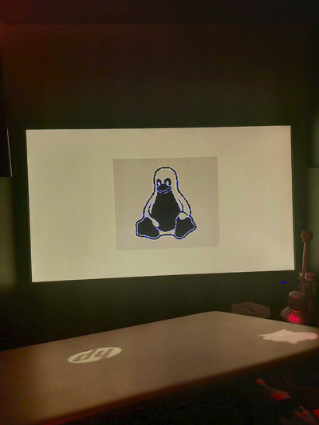

# diy-bootloader

A two-stage x86 real mode bootloader that loads a 256-color bitmap from disk and displays it with a fade in/out effect — no operating system, no drivers.

Built as a learning experiment to understand the PC boot process at the bare metal level.



---

## How It Works

```
BIOS → stage1 (512 bytes) → stage2 (2KB) → tux-8.bmp → VGA framebuffer
```

**Stage 1** (`stage1.asm`) fits in the 512-byte MBR. It normalizes the CPU state, saves the boot drive number from the BIOS, loads stage 2 from disk via LBA and jumps to it.

**Stage 2** (`stage2.asm`) switches the display to VGA mode 13h (320×200, 256 colors), loads the bitmap from disk, programs the VGA DAC with the image's palette, blits the pixel data to the framebuffer at `0xA0000`, and runs a continuous fade in/out loop synchronized to the vertical blank signal.

---

## Requirements

- `nasm`
- `qemu-system-x86_64` or `qemu-system-i386` for testing
- A USB drive and a machine with a BIOS that supports LBA for real hardware

```bash
sudo apt install nasm qemu-system-x86
```

---

## Build

```bash
nasm -f bin stage1.asm -o stage1.bin
nasm -f bin stage2.asm -o stage2.bin
cat stage1.bin stage2.bin tux-8.bmp > disk.img
truncate -s 1474560 disk.img
```

---

## Run in QEMU

```bash
# Must use if=ide — floppy emulation does not support LBA extensions
qemu-system-i386 -drive format=raw,file=disk.img,if=ide
```

---

## Run on Real Hardware

```bash
# Confirm your device with lsblk first — dd will overwrite without warning
sudo umount /dev/sdX*
sudo dd if=disk.img of=/dev/sdX bs=512 conv=fsync status=progress
```

Boot the target machine from USB. In the BIOS boot menu, prefer **USB-HDD** over USB-FDD if both are available.

---

## Disk Layout

| Sectors | Content |
|---------|---------|
| 0 | Stage 1 (MBR, 512 bytes) |
| 1–4 | Stage 2 (2048 bytes) |
| 5+ | `tux-8.bmp` (raw file) |

Stage 2 is padded to exactly 2048 bytes by the `times 2048-($-$$) db 0` directive so the bitmap always lands at a known sector boundary.

---

## Bitmap Requirements

- Format: uncompressed BMP (`BI_RGB`, compression = 0)
- Color depth: 8bpp (256 colors)
- Max dimensions: fits within 320×200
- The pixel data offset and image dimensions are hardcoded in `stage2.asm` — update `BMP_PIXEL_OFFSET`, `IMG_W`, `IMG_H` if you swap the image

To convert an existing image:
```bash
convert input.png -resize 128x128 -colors 256 -compress None BMP3:output.bmp
```

---

## Key Concepts

- **Real mode**: the 16-bit CPU mode active at boot, 1MB address space, no memory protection
- **LBA vs CHS**: CHS disk addressing encodes physical geometry assumptions that vary by device type; LBA treats the disk as a flat array of sectors and works consistently across USB drives, hard disks, and emulators
- **VGA mode 13h**: 320×200 linear framebuffer at `0xA0000`, one byte per pixel, palette indexed
- **VGA DAC**: 256 RGB registers programmed via ports `0x3C8`/`0x3C9`; the fade effect works by scaling these registers, never touching the framebuffer
- **Vertical blank sync**: port `0x3DA` bit 3 signals the vblank interval (~70Hz in mode 13h); palette updates are synchronized to it to avoid tearing

---

## To-Do

- [ ] Generate a calibration splash image (RGB stripes) to characterize BIOS and DAC/rasterizer behavior across different hardware
- [ ] Fix palette loading so background renders as true black
- [ ] Add a simple text menu in stage 2
- [ ] Stage 3 in 32-bit protected mode
- [ ] VESA modes for higher resolution

---

## Tags

`bare metal` `x86 assembly` `bootloader` `real mode` `VGA mode 13h` `BIOS`
